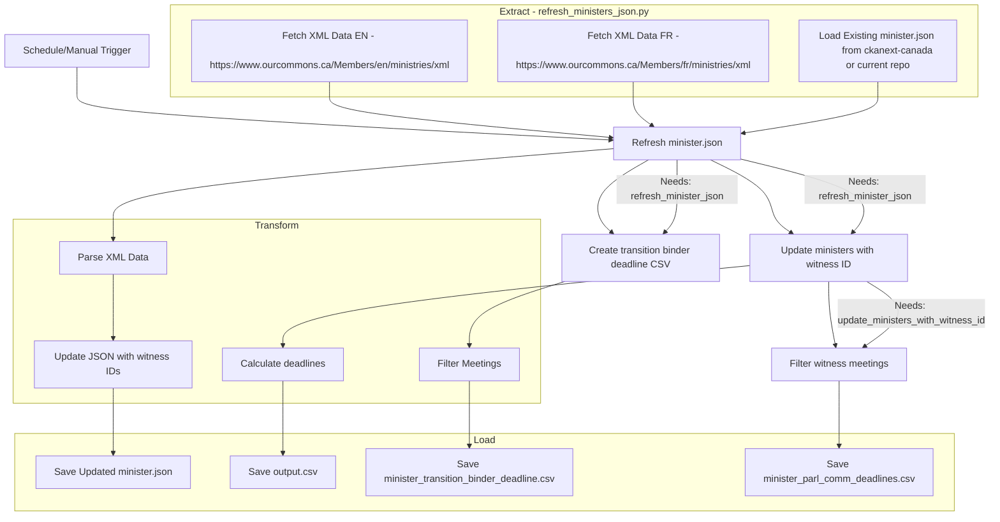

# sandbox_ATIA-data-pipelines
experimenting with a multisource data model to estimate GC compliance with Proactive Publication requirements

| File | Flat Viewer |
|--|--|
|**minister_transition_binder_deadline.csv**  deadlines for ministerial transition materials to be published, based on 120 days after appointment.  | |
|**minister_parl_comm_deadlines.csv**  deadlines for Parliamentry Committee materials to be published, based on 120 days after appointment.  | |